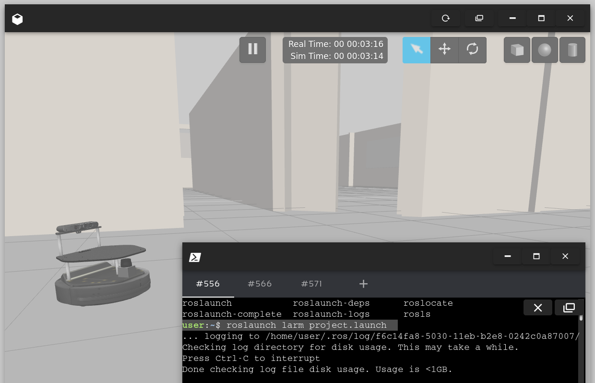
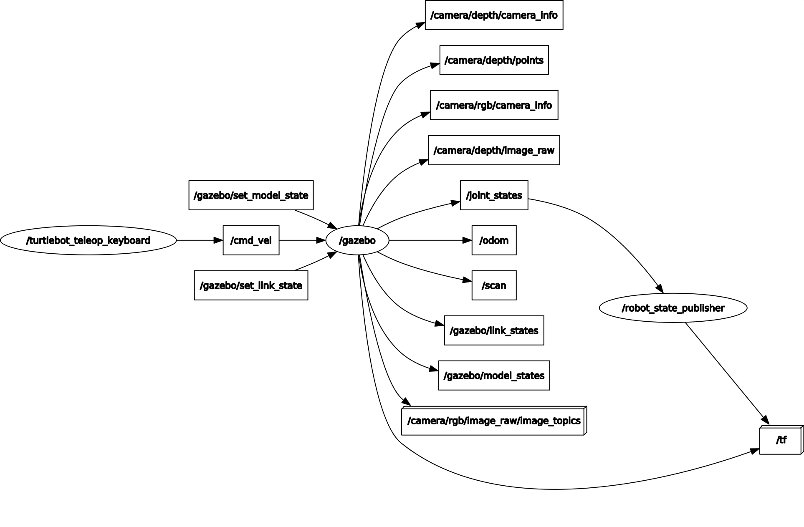

# LARM Simulation WorkSpace

## Installation (RDS)

1. Create a ROS-Melodic ROSjet on The construct RDS.
2. Clone and build this project in place of the initial `simulation_ws` directory. So, in RDS the terminal :

```bash
rm -fr simulation_ws
git clone https://github.com/ceri-num/LARM-RDS-Simulation-WS.git simulation_ws
cd simulation_ws
catkin_make
source devel/setup.bash
```

Test your install:

```bash
roslaunch larm large_world.launch
# open gazebo client
```

Don't forget to open Gazebo.

You should see:



And this ros graph:



## Next...

You can now, clone your own workspace in `catkin_ws` directory and develope your control solution.

